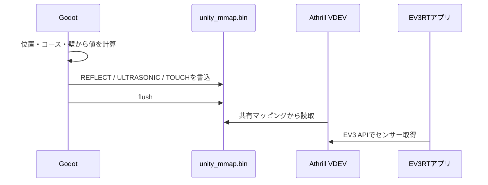
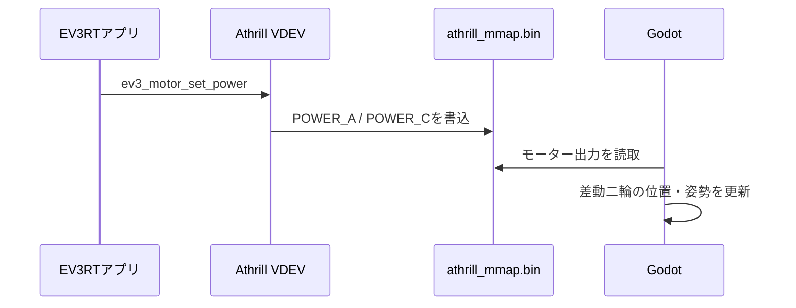
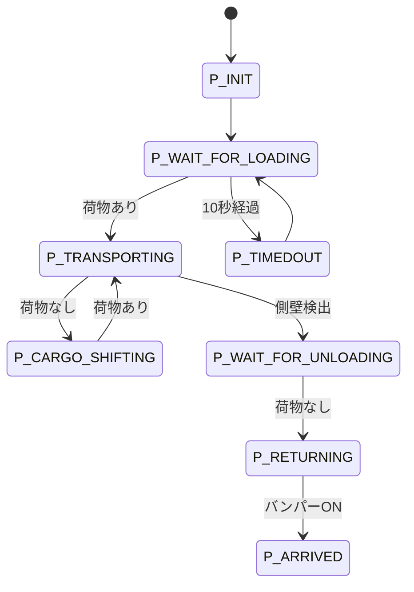
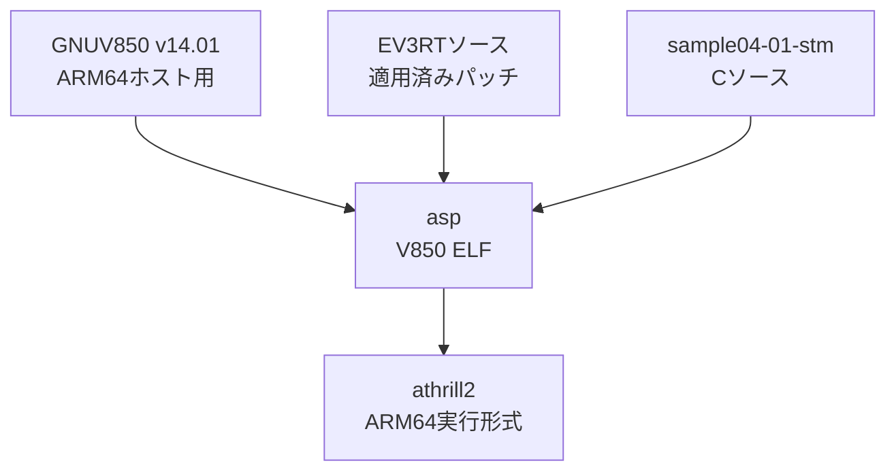

# システムアーキテクチャ

## 目的

このシステムは、EV3RT向けCアプリケーションをAthrill上で実行し、Godotが
提供する走行体とワールドをVDEV MMAPで接続する。

最も重要な設計原則は、制御ロジックとシミュレーション環境を分離することで
ある。制御・状態機械はEV3RT側、走行体・コース・壁・センサー表現はGodot側に
置く。

この分離により、実機用アプリケーションとシミュレーター用アプリケーションを
別々に作らず、通常のEV3 APIを使う同じCコードを両方で実行できる。

## 全体構成


### プロセスと成果物

| 要素 | 実行場所 | 主な役割 |
|---|---|---|
| EV3RTアプリケーション | Athrill内のV850 CPU | 制御判断、状態遷移、EV3 API呼び出し |
| EV3RTカーネル | Athrill内のV850 CPU | タスク、周期ハンドラ、時間管理 |
| Athrill | Ubuntuホスト | V850命令実行、デバイスエミュレーション、VDEV |
| `unity_mmap.bin` | Ubuntu共有ファイル | GodotからEV3RTへのセンサー入力 |
| `athrill_mmap.bin` | Ubuntu共有ファイル | EV3RTからGodotへのモーター・LED出力 |
| Godot | Ubuntuホスト | 走行運動、コース、壁、センサー、表示、操作 |

## 責務境界

### EV3RT Cアプリケーション

EV3RT側が担当するもの:

- 荷物運搬ステートマシン
- ライントレースの左右モーター制御
- 荷物搭載、配達先、車庫到着の判断
- タイマーとタイムアウト
- EV3 LCDへ表示する状態名
- EV3 APIを介したセンサー読み取りとアクチュエーター操作

EV3RT側へ置かないもの:

- Godot画面座標
- コースの線分・円弧
- 壁との幾何交差
- シミュレーター固有のキー入力
- VDEV共有ファイルの直接操作

### Godot

Godot側が担当するもの:

- 差動二輪の位置・姿勢更新
- A1角丸矩形コースの表現
- 車体と上面画像の表示
- カラーセンサー位置と反射値の生成
- 横向き超音波センサーと配達先壁の距離
- 前方バンパーと車庫壁の接触
- 荷物搭載操作
- VDEV RX書き込みとTX読み取り

Godot側へ置かないもの:

- ライン上でどちらのモーターを回すかという制御判断
- 荷物運搬の状態遷移
- 配達・回送・到着の業務判断
- EV3RTタイマーの代替

### AthrillとEV3RTドライバー層

AthrillとEV3RTドライバー層は、EV3 APIとホスト側VDEVデータを接続する。

- EV3RTアプリケーションは通常のEV3 APIを呼ぶ
- EV3RTドライバーがVDEVレジスターを読み書きする
- Athrillがレジスターアクセスを共有ファイルへ橋渡しする
- Godotは共有ファイルだけを読み書きする

これにより、アプリケーションはVDEVやGodotを認識しない。

## 実行時データフロー

### センサー入力



Godotが生成する主な入力:

| 入力 | 用途 |
|---|---|
| `REFLECT` | カラーセンサーによるライントレース |
| `ULTRASONIC` | 右側の配達先側壁までの距離 |
| `TOUCH_0` | 前方バンパーによる車庫壁検出 |
| `TOUCH_1` | 左側荷台の荷物搭載状態 |

### モーター出力



`sample04-01-stm`ではポートAが左モーター、ポートCが右モーターである。

## LCD出力はVDEVと別経路

EV3 LCD文字列はVDEV MMAPを通らない。


Athrill向けEV3 API実装がLCD文字列を標準出力へ転送する。同じLCD行へ同じ
文字列が繰り返された場合は、EV3 APIエミュレーション層で重複を抑止する。

アプリケーションは実機と同じように毎周期LCD APIを呼び出せる。

## 荷物運搬シーケンス



通常の完全動作では次の経路を通る。

```text
P_INIT
P_WAIT_FOR_LOADING
P_TRANSPORTING
P_WAIT_FOR_UNLOADING
P_RETURNING
P_ARRIVED
```

## 時間モデル

### EV3RT制御周期

`sample04-01-stm`の周期ハンドラは50 ms周期でメインタスクを起動する。
センサー取得、状態遷移、モーター出力はEV3RT側のこの周期で行われる。

### Godot物理周期

走行体は`_physics_process()`の固定時間刻みで更新する。描画周期に依存する
`_process()`は使用しない。

可変描画周期を使うと、ファイルI/Oなどでフレーム時間が増えたとき、1回の
更新でカラーセンサーがラインを横断することがあった。

### VDEV交換周期

Godotは10 msをVDEV交換間隔として指定している。実際にはGodotの固定物理
フレームごとに最新値を交換する。

EV3RT周期と同じ50 msに固定すると、位相によって短いセンサー変化を
取りこぼす可能性がある。

### Athrillの実時間ペーシング

現在は次を有効にしている。

```text
DEBUG_FUNC_ENABLE_SKIP_CLOCK 1
DEBUG_FUNC_ENABLE_SYNC_TIME  1
```

Athrillの実時間ペーシングは動作する。一方、GodotがRXヘッダーへ書く
`unity_simtime`は現在0であり、Godotのシミュレーション時刻を基準とする
正式な時刻同期は未実装である。

## ビルド時の構成



ビルド前に`prepare_ev3rt.sh`がEV3RT向けパッチを未適用の場合だけ適用する。

- Ruby 3およびconfigure対応
- AthrillコンソールへのEV3 LCD文字列出力

Athrill本体は別スクリプトでビルドし、ARM64のEOF処理修正を適用する。

## 実行とリセット

通常の起動順:

1. Athrillを起動する
2. Godotプロジェクトを実行する
3. Godot実行画面へ入力フォーカスを与える
4. `L`キーで荷物を積載する

`Space`キーはGodot側の車体位置と姿勢だけを初期化する。EV3RTカーネル、
状態機械、タイマーはリセットしない。

完全に最初から実行する場合はAthrillを停止・再起動し、Godot側の車体位置も
初期位置へ戻す。

## 変更時の判断基準

機能追加や修正では、次の順序で責務を判断する。

1. 実機EV3RTでも必要な制御・状態判断か
   - EV3RT Cアプリケーションへ置く
2. 実機デバイスをAthrill上で再現する処理か
   - EV3RTドライバーまたはAthrillターゲット依存部へ置く
3. ワールド、物理、センサー環境、表示、操作か
   - Godotへ置く
4. プロセス起動、停止、パッチ、ビルドの手順か
   - `scripts/`へ置く

シミュレーションを動作させるためだけにEV3RTの制御ロジックを変更しない。

## 関連文書

- [`README.md`](../README.md)
- [`vdev_protocol.md`](vdev_protocol.md)
- [`physical_model.md`](physical_model.md)
- [`troubleshooting.md`](troubleshooting.md)
