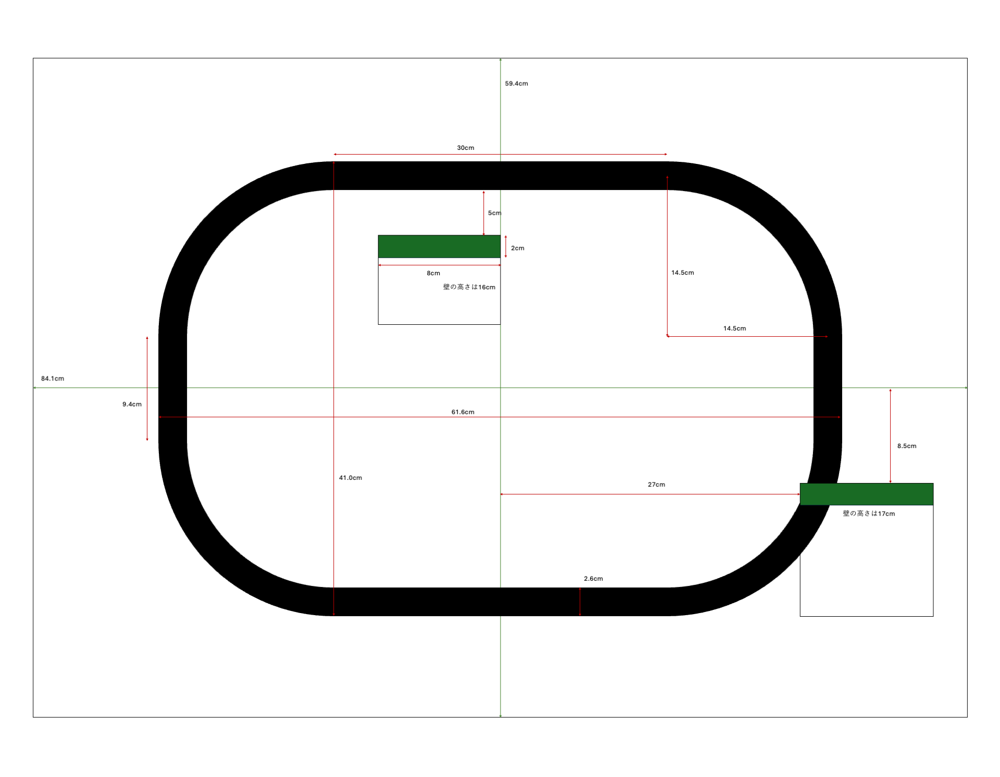
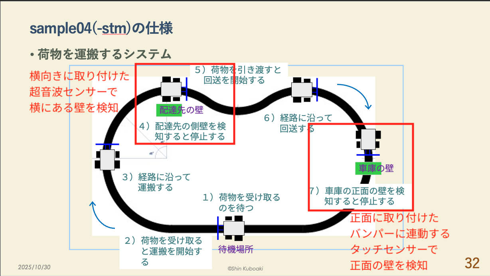

# Godot走行体・コース物理モデル

## 目的

EV3RT/Athrill上の制御コードを変更せず、実機と同じCコードをGodot上で
検証するための物理パラメータと、その根拠を記録する。

## 実測した走行体寸法

| 項目 | 値 |
|---|---:|
| 車体の前後方向 | 23 cm |
| 車体の左右方向 | 18 cm |
| 車体の高さ | 17.5 cm |
| 車輪直径 | 5.8 cm |
| 車輪幅 | 2.9 cm |
| 左右車輪間の空間 | 8.8 cm |
| 車輪中心間距離 | 11.8 cm |
| 旋回中心 | 左右車輪の中間 |
| カラーセンサー前方オフセット | 8.0 cm |
| カラーセンサー右方オフセット | 5.6 cm |

カラーセンサー中心と旋回中心の距離は次の導出値になる。

$$
\sqrt{8.0^2 + 5.6^2} \approx 9.77\ \mathrm{cm}
$$

## EV3 Lモーター仕様

| 項目 | 値 |
|---|---:|
| フィードバック分解能 | 1度 |
| 回転数 | 160～170 rpm |
| 定格トルク | 0.21 N・m |
| 停動トルク | 0.42 N・m |
| 重量 | 76 g |

直径5.8 cmの車輪の円周は次のとおり。

$$
\pi \times 5.8 \approx 18.22\ \mathrm{cm}
$$

回転数の中間値165 rpmに対し、power 20で回転数が単純比例すると仮定した
無負荷速度は次のとおり。

$$
165 \times 0.20 = 33\ \mathrm{rpm}
$$

$$
33 \times 18.22 \div 60 \approx 10.0\ \mathrm{cm/s}
$$

実際には車体荷重、床との摩擦、片輪停止旋回時の負荷、PWMと回転数の
非線形性がある。このためGodotモデルの初期校正値は6 cm/sとした。
これは実機測定後に再校正する暫定値である。

## Godot内の単位換算

現在の表示スケールは次のとおり。

```gdscript
const PIXELS_PER_CM := 5.0
const MM_PER_PIXEL := 10.0 / PIXELS_PER_CM
```

モーター速度は次の式で求める。

$$
v_{\mathrm{pixel/s}} =
\mathrm{power} \times \mathrm{MOTOR\_SPEED\_SCALE}
$$

現在値は次のとおり。

```gdscript
const MOTOR_SPEED_SCALE := 1.5
```

power 20の場合:

$$
20 \times 1.5 = 30\ \mathrm{pixel/s}
$$

$$
30 \div 5 = 6\ \mathrm{cm/s}
$$

以前の`MOTOR_SPEED_SCALE=3.0`は12 cm/sに相当し、実機推定値より速かった。

## コース

ライン幅は一般的な1インチ相当として2.6 cmを使用する。

```gdscript
const LINE_WIDTH := 2.6 * PIXELS_PER_CM
```

現在の角丸矩形コースはA1用紙上への配置を想定した初期モデルである。

| 項目 | 値 |
|---|---:|
| 水平直線部 | 30.0 cm |
| 垂直直線部 | 9.4 cm |
| コーナー半径 | 14.5 cm |
| 中心線外形幅 | 59.0 cm |
| 中心線外形高さ | 38.4 cm |

コース寸法は実際に使用する印刷コースへ合わせて再確認する。

### A1走行コース見取り図



印刷用資料: [a1_course_layout.pdf](a1_course_layout.pdf)
編集元: [a1_course_layout.pptx](a1_course_layout.pptx)

## 制御周期とGodot更新周期

EV3RTの周期ハンドラは50 ms周期である。

走行体の位置・姿勢は描画周期に依存する`_process()`ではなく、
固定時間刻みの`_physics_process()`で更新する。

可変描画周期で更新した場合、描画やMMAPファイルI/Oの遅延によって
`delta`が大きくなり、カラーセンサーが1ステップでラインを横断して
進行方向が反転することがあった。固定物理周期への変更後は継続周回を確認した。

VDEV MMAPはメモリ上のレジスタとして扱うため、Godot側の交換周期を
EV3RT周期と同じ50 msには固定しない。現在は10 msを指定し、実際には
Godotの物理フレームごとに最新値を交換する。

## センサーモデル

カラーセンサーは旋回中心から前方8.0 cm、右方5.6 cmに配置する。
コース中心線からセンサー中心までの距離がライン半幅以内の場合に
反射値5、それ以外の場合に反射値50を返す。

```text
ライン上   -> REFLECT=5
ライン外   -> REFLECT=50
```

## 壁と到着検出



壁は2種類あり、ブックエンドの土台と垂直壁を区別する。
土台部分は高さがほぼ0なのでセンサー判定対象外とし、垂直壁だけを
厚みのない有限線分として扱う。

| 壁 | 幅 | 高さ | センサー | 状態遷移 |
|---|---:|---:|---|---|
| 配達先の側壁 | 8 cm | 16 cm | 右向き超音波センサー | `P_TRANSPORTING`から`P_WAIT_FOR_UNLOADING` |
| 車庫正面の壁 | 12 cm | 17 cm | 前向きバンパー | `P_RETURNING`から`P_ARRIVED` |

センサー配置は次のとおり。

| VDEV入力 | 取付位置 | 用途 |
|---|---|---|
| `ULTRASONIC` | 車体右側、横向き | 配達先側壁の非接触検出 |
| `TOUCH_0` | 車体前方 | 車庫正面壁へのバンパー接触 |
| `TOUCH_1` | 超音波センサーと反対の車体左側 | 荷台の荷物搭載検出 |

LDrawモデルの部品原点から、超音波センサーの初期位置を
旋回中心から後方5.6 cm、右方4.0 cmとした。検出方向は車体右向きである。
`TOUCH_1`はGodotの`L`キーで荷物の積載・荷下ろしを切り替える。

超音波センサーは、右向きレイと配達先側壁線分の交点までの距離を返す。
交点がない場合は2550 mmを返す。前方バンパーは、先端と車庫壁線分の
距離が0.5 cm以下の場合にONとする。バンパー先端の前方オフセット11 cmは
未実測の初期値である。

以前のGodotモデルは、1本の`WALL_X`を両センサーで共有し、
超音波センサーも前向きとして無限縦線との距離を計算していた。
このため実在しない壁を検出して状態5へ遷移した。

壁判定を無効化した試験では、状態2のまま複数周の継続走行を確認した。
有限壁と正しいセンサー方向を実装した完全動作試験では、次の遷移を確認した。

```text
1 P_WAIT_FOR_LOADING
2 P_TRANSPORTING
5 P_WAIT_FOR_UNLOADING
6 P_RETURNING
7 P_ARRIVED
```

配達先と車庫の両方で `POWER_A=0` 、`POWER_C=0` となり停止した。

## 再校正が必要な項目

- power値と実機走行速度の対応
- 超音波センサー検出面の正確な位置
- バンパー先端位置
- カラーセンサーの実際の検出領域
- 実際に使用するコースの中心線寸法
- 車体の慣性、加減速、タイヤの滑り
